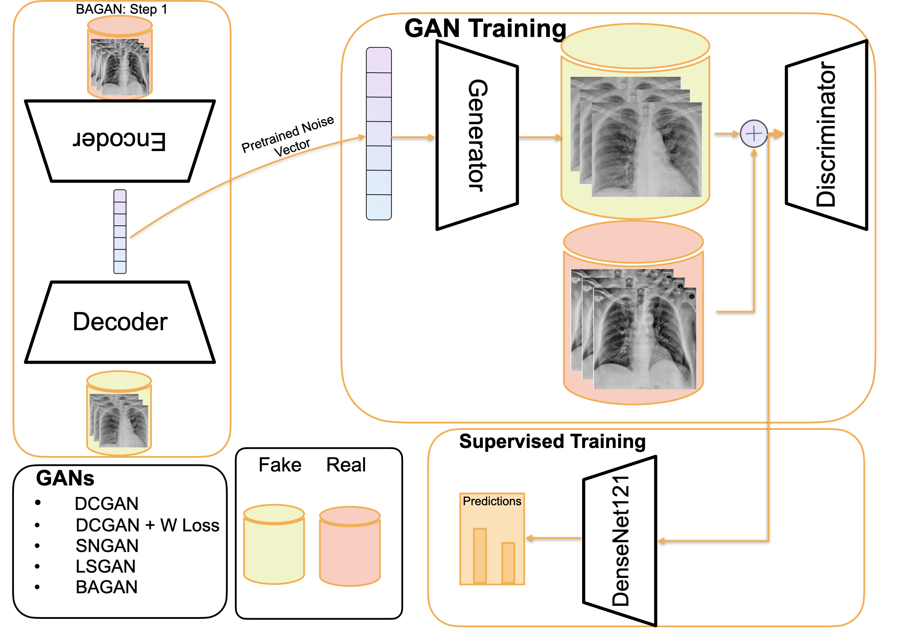
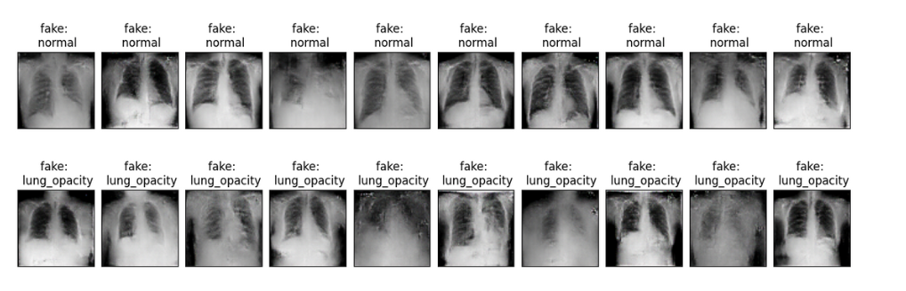

# GAN-based Data Augmentation for class imbalance in Chest X-ray



## Download Data
```bash
$ bash bash_scripts/run_data.sh
```
| Dataset | Link | Download Directory
| -----   | :----:| ----: |
|   RSNA      |  https://www.kaggle.com/c/rsna-pneumonia-detection-challenge/data    | `data/RSNA_Pneumonia`
|   COVID-19      |  https://github.com/muhammedtalo/COVID-19    | `data/COVID-19`
|   COVID-chestxray-dataset      |    https://github.com/ieee8023/covid-chestxray-dataset  | `data/covid-chestxray-dataset`

## Baseline (Supervised DenseNet121)
```python
$ python main.py --with_gan "" --idx 0 --user "vasu" --skip_training ""  --dataset_size  10  --dataset  "COVID"  --fraction  0.5  --epochs  30  --data_aug  "True"
```

For more info, read about the arguments `$ python main.py --help`

## GANs


| **GAN** | **Path** | **Loss** |
| :---- | :-----: | -----: |
|DCGAN|`scripts/GANs/DCGAN.py`| BCE Loss|
| WGAN | `scripts/GANs/DCGAN_GP_conditional.py`| W-Loss + Gradient Penalty|
| SNGAN | `scripts/GANs/SNGAN.py` | Spectral Normalization | 
| LSGAN | `scripts/GANs/LSGAN.py` | Least Sqaures GAN | 
| IMPROVED BAGAN | `scripts/GANs/improved_bagan/imp_bagan.py` | Gradient Penalty | 

```python
$ python scripts/GANs/SNGAN.py --dataset COVID-small --user vasu --with_gan True --epochs 200 --lr 2e-3 --display_step 100 --z_dim 128 --GAN_type SNGAN --batch_size 32  --im_channel 3 --patience 30 --n_class_generate 0 --num_images_per_class 250
```
To run Improved BAGAN: `$ python scripts/GANs/improved_bagan/imp_bagan.py`

For more info, read about the arguments `$ python scripts/GANs/SNGAN.py --help`

## Acknowledgements
This repository makes use of the code from the following repositories. We thank all the authors for making their code publically available.
- https://github.com/ssundaram21/6.819FinalProjectRAMP
- https://github.com/GH920/improved-bagan-gp

